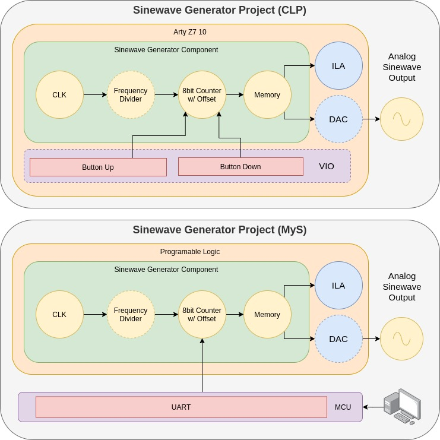
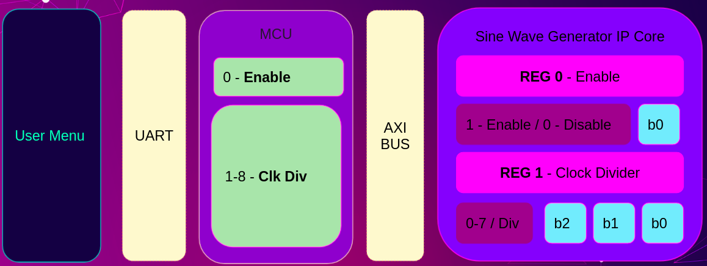
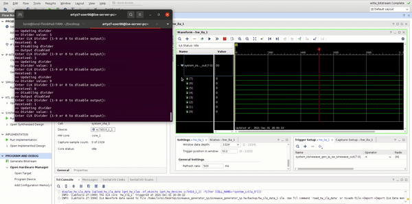

# Microarquitecturas y Softcores: Generador de Señales Senoidales (VHDL)

## Descripción
El objetivo del presente trabajo consiste en la construcción de un "IP Core"
partiendo de un bloque de HDL funcional, controlando al mismo desde el 
software programable en una arquitetura Zynq.

El bloque funcional a "empaquetar" en el "IP Core" es un generador de señales
senoidales de frecuencia variable, desarrollado para la materia "Circuitos 
Lógicos Programables". El mismo se puede encontrar en [éste]([clp-link]) 
repositorio.

A continuacion se muestra una comparación de la arquitectura del proyecto del
cual se parte y el objetivo final del proyecto corriente:

Puede observarse que la diferencia principal, a nivel funcional, radica en que
el bloque de generación de señal ya no será controlado mediante botones 
(ya sea físicos o virtuales) sino mediante comandos envíados por el MCU
provisto por el hardware. Para lograr ésto último, enel MCU se ejecuta un 
pequeño programa cuyo único objetivo es interpretar comandos recibidos por 
protocolo UART (envíados desde una terminal de una PC) e interpretarlos para
envíar, bus AXI mediante, el comando al IP Core que contiene el generador de 
senoidales del proyecto anterior. Estas relaciones pueden verse reflejadas en
el siguiente esquema:

Los comandos permiten interactuar con los dos únicos registros que expone el IP Core:
- `Enable`: permite habilitar/deshabilitar la salida del bloque de senoidal.
- `Clock Divider`: permite reducir/ajustar la frecuencia de la senoidal de salida.

## Organización del Repositorio
El repositorio que contine el código y los archivos necesarios para abrir y correr
el proyecto se encuentra [aquí](https://github.com/lorsi96/Sinewave-Generator-IPCore-Demo). 

Dado que la estructura del respositorio se encuentra organizado de forma 
conveniente para Vivado (plataforma de desarrollo), no es sencillo ubicar por simple 
inspección los archivos de código fuente relevantes. Por ello, se listan los archivos/
directorois de mayor relevancia a continuación:

### Lógica Progamable
- [IP Core HDL Sources](ip_sinewave_gen_peripheral/sinewave_gen_peripheral_1.0.0/hdl)
- [Top Sources](sinewave_generator_ip.srcs/sources_1/bd/system)

### Software del MCU
- [Top/Main](sinewave_generator_ip.sdk/sinewave_gen/src/sinewave_gen_top.c)

### Resultados Obtenidos
Luego de haber empaquetado el *IP Core* y escrito el código del *MCU*, se verificó mediante el ILA (Integrated Logic Analyzer) del hardware en el que se realizó la prueba que la salida efectivamente tuviese forma de onda senoidal y que la frecuencia fuese variable acorde a los comandos envíados. 

## Tabla de uso de recursos
Finalmente se adjunta la tabla de uso de recursos. Notar que del total de recursos utilizados, aproximadamente 1/3 corresponde al *Debug Hub* que comprende el ILA utilizado para validar el diseño, pero que no sería necesario para producción.

| Name              | Slice LUTs | Slice Registers | F7 Muxes | F8 Muxes | Slice  | LUT as Logic | LUT as Memory | LUT Flip Flop Pairs | Block RAM Tile |
|-------------------|------------|-----------------|----------|----------|--------|--------------|---------------|---------------------|----------------|
| **system_wrapper**    | **9.12%**      | **6.84%**           | **0.51%**    | **0.18%**    | **17.93%** | **8.28%**        | **2.47%**         | **4.65%**               | **0.83%**          |
| dbg_hub (dbg_hub) | 2.64%      | 2.05%           | 0.00%    | 0.00%    | 5.32%  | 2.50%        | 0.40%         | 1.68%               | 0.00%          |
| system_i (system) | 6.48%      | 4.79%           | 0.51%    | 0.18%    | 12.80% | 5.78%        | 2.07%         | 2.97%               | 0.83%          |

[clp-link]:https://github.com/lorsi96/VHDL-Sinewave-Generator
